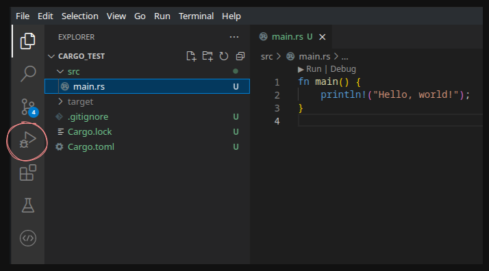

# Rust för inbyggda system - En introduktion
## Vad är Rust?
>Rust is a modern systems programming language developed by the Mozilla Corporation. It is intended to be a language for highly concurrent and highly secure systems. It compiles to native code; hence, it is blazingly fast like C and C++.

[Tutorialspoint on Rust](https://www.tutorialspoint.com/rust/index.htm)

Vad är då fördelen med Rust?
>Systems and application programming languages face two major problems
>-   It is difficult to write secure code.
>-   It is difficult to write multi-threaded code.

Iden med Rust är att ha ett programmeringsspråk som prioriterar att utveckla snabba, hårdvarunära program. Detta görs med _concurrency_, dvs att programmet består av olika delar som kan köras samtidigt.

## Rustup
[Tutorialspoint](https://www.tutorialspoint.com/rust/rust_environment_setup.htm)

_Rustup_ är ett terminalbaserat verktyg för att hantera versioner av rustkompilatorn och de verktyg som krävs för att kompilera rustkod.

När rustup installeras kommer också en kompilator för rust att hänga med, kallad _rustc_.

### Rustup installation - Manjaro
```shell
sudo pacman -S rustup
```

## Introduktion till rust
Här kommer en introduktion till rust. Om du känner att du har koll kan du skippa den. Annars om du känner dig relativt säker men vill ha en genomgång om ägandeskap kan du kolla [[#Exempel 8 - Ägandeskap]] och [[#Exempel 9 - Lånande]].

### Exempel 1 - Hello World
Vi börjar med ett enkelt exempel. Vi ska skriva ett _hello world_ program i rust och kompilerar det för att köras på din dator.

Börja med att skapa en mapp som heter `exempel1-helloWorld`
```shell
mkdir exempel1-helloWorld
cd exempel1-helloWorld
```

Där i vill vi skapa sourcefilen för hello world programmet
```shell
touch helloWorld.rs
```

Notera att filändelsen för rust är `.rs`

Senare går vi igenom hur man använder en IDE för att skriva, kompilera och köra rustkod i. Men för enkelhetens skull börjar vi med att använda en textredigerare för att skriva koden i och en terminal för att kompilera och köra i.

Öppna denna fil i en textredigerare. Jag rekommenderar [Sublime Text](https://www.sublimetext.com/) för enkelhetens skull. Där lägger du till.

```rust
fn main()  
{
	println!("Hello world!");  
}
```

Här har vi några nyckelord.

`fn` är en definition för att skapa en funktion, och
`fn main()` är då den funktionen som kommer att köras när ett kompilerat rustprogram startar.

`println!` är ett _macro_ för att printa text. Ett macro är egentligen ett namn för en bit kod som är definierad på något annat ställe. Vi som programmerare behöver inte veta exakt hur ett program ska bära sig åt för att printa text på en terminal, utan vi vill bara kunna göra det. Därför använder vi ett macro för att printa text, som sedan ersätts med den bit kod som är nödvändig just för att printa under kompileringsprocessen.

Det viktiga du behöver veta är att ett macro alltid markeras i rust med ett utropstecken, därför är det `println!` och inte `println`.

#### Kompilera programmet
För att kompilera programmet använder vi en kompilator som hänger med i [[#Rustup|rustup]], kallad _rustc_. I `exempel1-helloWorld` där sourcefilen `helloWorld.rs` ligger vill du vara. Där kallar du på `rustc` och skickar in sourcefilen som ska kompileras.
```shell
rustc helloWorld.rs
```

Detta kommer genera en fil med samma namn, fast utan filändelsen `.rs`. Detta är vårt program.

Testa att köra programmet i terminalen
```shell
./helloWorld
```

Skriver den ut _Hello world!_? Isåfall funkade allt, och din kod kompilerades.

### Exempel 2 - Printa med argument
När man testar saker i vilket programmeringsspråk som helst, kan det vara bra att kunna printa vad en variabel innehåller. I rust kan vi, istället för att själv göra en sträng och sätta i variabeln i den, printa med _argument_.

Det betyder egentligen att vi skriver i en sträng _vart ett argument ska skrivas ut_. Detta görs i rust med `{}`.

Vi gör ett exempelprogram där vi sparar antalet bröder du har i en variabel, och sedan printar denna variabel.

Gör en ny mapp med namnet `example2-printaMedArgument` och i den, skapa en sourcefil med namnet `howManyBrothers.rs`.
```shell
mkdir example2-howManyBrothers
cd example2-howManyBrothers
touch howManyBrothers.rs
```

I denna nya fil kan du skriva följande
```rust
fn main()
{
	println!("I have {} brothers.", 3);
}
```

Sedan kompilera och kör programmet på samma sätt som i exempel 1
```shell
rustc howManyBrothers.rs
./howManyBrothers
```

Det som händer nu är att rust ser att du har ett argument, `3` i mitt fall, och att du har `{}` i strängen som ska printas. Rust tar därför argumentet och sätter in det där det står `{}`, vilket resulterar i `I have 3 brothers.`

### Exempel 3 - Variabler
Rust kan, på samma sätt som till exempel python, själv räkna ut vilken typ en variabel ska vara utifrån den data du skickar in i denna.

För att deklarera en variabel i rust använder du `let`.

Vi gör om det föregående exemplet, fast nu använder vi en variabel för att spara hur många bröder du har.
```shell
mkdir example3-howManyBrothersVar
cd example3-howManyBrothersVar
touch howManyBrothersVar.rs
```

Nu vill vi istället specificera en variabel där vi sparar hur många bröder du har och sedan använder den här variabeln i printsatsen.
```rust
fn main() {  
	let brothers = 3;  
	println!("I have {} brothers.", brothers);  
}
```

Testa att kompilera och köra detta
```shell
rustc howManyBrothersVar.rs
./howManyBrothersVar
```

Vi kan dock säga explicit till rust att en variabel ska vara en specifik typ. Om vi till exempel vet att vi behöver inte ha ett negativt antal bröder, och vi kommer aldrig ha mer än 255 bröder. Isåfall kan vi spara antalet bröder i en unsigned (positiv) 8-bitars heltal; en `u8`.

I rust specificerar vi detta igenom att skriva ett kolon efter variabelnamnet och sedan vilken typ den ska vara (innan lika med tecknet).

Testa att lägga till detta
```rust
fn main() {  
   let brothers:u8 = 3;  
   println!("I have {} brothers.", brothers);  
}
```

Kompilerar du och kör detta, kommer du få samma resultat som förut. Skulle du nu dock välja att ha ett negativt antal bröder, kommer rust inte att låta dig kompilera då vi explicit sagt att denna variabel ska vara ett **positivt** 8-bitars tal.

Testa att byta antalet bröder till `-1` och kompilera.
```rust
fn main() {  
   let brothers:u8 = -1;  
   println!("I have {} brothers.", brothers);  
}
```

Detta resulterar i följande error
```shell
 |     let brothers:u8 = -1;  
 |                       ^^  
 |                       |  
 |                       cannot apply unary operator `-`
```

Alltså, operatorn `-` funkar inte på ett positivt heltal. Vill du läsa mer om olika typer rekommenderar jag [Tutorialspoint: Rust - Data Types](https://www.tutorialspoint.com/rust/rust_data_types.htm).

### Exempel 4 - Ändra variabler
I de flesta programmeringsspråk har du variabler som man kan ändra värde på, och variabler som du specificerat ska vara konstanta (dvs att dessa inte ska ändras efter att de skapats). 

Detta är dock inte fallet i rust. Här måste du istället specificera att en variabel **ska** gå att ändra på.

Vi testar med ett nytt exempel
```shell
mkdir example4-howManyBrothersUpdate
cd example4-howManyBrothersUpdate
touch howManyBrothersUpdate.rs
```

Säg att du har ett program där du sparar hur många bröder du har och sedan printar ut detta antal. Men precis mellan det ögonblick programmet sparar antalet bröder och ska printa ut det, får du en ny bror (något av ett edge case men ändå). Du vill därför ändra antalet bröder du har efter att du skapat variabeln.
```rust
fn main()  
{ 
	let brothers = 3;
	println!("I have {} brothers.", brothers);

	brothers = 4;  
	println!("I now have {} brothers.", brothers);  
}
```

Försöker du kompilera detta får du följande error
```shell
 |     brothers = 4;  
 |     ^^^^^^^^^^^^ cannot assign twice to immutable variable
```

Det den säger är i princip att du försöker skriva över en _immutable_ (konstant) variabel.

Det man behöver göra i rust för att en variabel ska få ändras, är att specificera att den ska vara _mutable_ (muterbar/möjlig att ändra). Detta gör du med nyckelordet `mut`.

Testa att lägga till `mut` framför deklarationen av variabeln (mellan `let` och variabelnamnet)
```rust
fn main()  
{ 
	let mut brothers = 3;
	println!("I have {} brothers.", brothers);

	brothers = 4;  
	println!("I now have {} brothers.", brothers);  
}
```

Nu lyckas programmet kompileras och köras.

Variabler kan även deklareras som _konstanta_ i rust, vilket ger dem en del mer restriktioner. Är du mer intresserad av det kan du läsa [Tutorialspoint: Rust - Constants](https://www.tutorialspoint.com/rust/rust_constant.htm).

### Exempel 5 - Strängar
Rust gör en distinkt skillnad mellan två sorters strängar; litterala strängar och strängobjekt.

En _litteral sträng_ är en sträng som definieras under kompileringen och sedan används av programmet, men den ändras aldrig. Exempelvis om du har en meny i ditt program, där alla alternativ skrivs ut i en terminal. Programmet kommer aldrig att själv ändra sin meny, och därför kan denna sträng vara statisk.

Notera att detta inte betyder att du inte kan spara strängen i en variabel. Det kan du göra med följande typ.
```rust
fn main() {
	let name:&str = "Josef";
}
```

Ett strängobjekt är en sträng som programmet själv kommer att ändra på. För att få en sån behöver du skapa strängobjektet med funktionen `new()`.
```rust
fn main() {
	let mut buffer = String::new();
}
```

För att ändra strängen sedan finns en massa funktioner (kolla in [Tutorialspoint: Rust - String](https://www.tutorialspoint.com/rust/rust_string.htm)). I exempel kan vi använda funktionen `push_str()`, för att fylla på strängobjektet med en litteral sträng (alltså en vi vet vad den innehåller under kompileringen)
```rust
fn main() {
	let mut buffer = String::new();
	buffer.push_str("Hello");
}
```

### Exempel 6 - If-satser, loopar och sånt
Vi går snabbt igenom lite om if-satser, loopar och liknande.

I rust behöver du inte ha parenteser runt if, for och while satser (på samma sätt som i python)
```rust
// En if-sats utan paranteser
if i == 2 {
	// Do stuff
}
```

For loopar i rust ser också lite annorlunda ut. Du behöver inte deklarera en variabel som du sedan använder för att loopa över. Rust kan lista ut det själv.

För att loopa från ett värde till ett annat använder du det som heter `in` och definierar en range som ska loopas över. Här loopar vi från 0 till, men inte med, 10
```rust
for j in 0..10 {
	// Do stuff
}
```

Vill du läsa på mer, kan du se över [Tutorialspoint: Rust - Loop](https://www.tutorialspoint.com/rust/rust_loop.htm)

### Exempel 7 - Funktioner
Funktioner i rust deklareras med nyckelordet `fn`. Man kan specificera vad funktionen retunerar med `-> type`.
```rust
fn function_name(var1, var2) -> return_type {
   // Stuff
   return value;
}
```

Man kan också retunera ett värde i en funktion igenom att avsluta en funktion **utan** semikolon på slutet
```rust
fn function_name(var1, var2) -> return_type {
   // The same thing as return value;
   value
}
```

Variabler för indata till funktionen kan man också specificera vilka typer det ska vara, på samma sätt som när man deklarerar en variabel
```rust
fn function_name(var1:u8, var2:&str) {
   // Stuff
}
```

Förutom explicita värden kan referenser till variabler skickas in i funktioner (som pekare i C)
```rust
fn main()
{
	let mut no:i32 = 5;
	mutate_no_to_zero(&mut no);
	println!("The value of no is:{}",no);
}
fn mutate_no_to_zero(param_no:&mut i32)
{
	*param_no = 0; //de reference
}
```

### Exempel 8 - Ägandeskap
En del som är mer omständligt i rust jämfört med till exempel C eller python, är att **en variabel kan endast ägas av en funktion**.

Här måste vi dock göra en distinkt skillnad mellan variabler som är av en _primitiv typ_ eller en som inte är det.

En variabel av en primitiv typ är en enkel variabel som är inbyggd i rust (typ). Detta inkluderar till exempel `u8`, `i8`, `f8`, `bool` och `char`.

Men när en variabel är mer komplicerad, någonting som kanske kan vara olika storlekar eller en typ som du som användare skapad (en klass till exempel), är detta inte en primitiv typ.

I C++ kan du till exempel ha en funktion som tar in en referens till en variabel. Här använder vi en vektor då det inte är en primitiv typ. Funktionen kan ändra på datan i vektorn, som då också ändras för datan där funktionen kallades
```cpp
// Funktion som tar in en referens för en vektor
void bar(vector<int>& vect)
{
	// Referera till variabeln ändra något i den
	vec.push_back(3);
}
void foo()
{
	// Skapa en vektor och sätt två av värdena i den
	vector<int> vect;
    vect.push_back(1);
    vect.push_back(2);
	
	// Kalla på bar med vektorn
	bar(vec);
	
	// Vi kan nu fortfarande använda vektorn, 
	// men storleken har ändrats efter att bar 
	// har kallats
	cout << vec.size() << endl;
}
```

I rust däremot gäller följande
- En variabel får bara _ägas_ av en funktion i taget
- Två variabler får inte peka på samma minnesadress

Det här påverkar mest icke-primitiva typer. Lite senare går vi igenom hur det funkar för primitiva typer.

Det betyder i princip att samma kod i rust inte hade fungerat. Det är för att efter att funktionen `bar` kallas på med variabeln som indata, _konsumeras_ denna variabel av funktionen och kan inte längre användas.
```rust
// Funktion som tar in en vektor och ändrar på den  
fn bar(mut vec:Vec<u8>)  
{  
	vec.push(3);
}  
  
fn main()  
{  
	// Skapa en vektor  
	let mut vec:Vec<u8> = Vec::new();  
	vec.push(1);  
	vec.push(2);  
	// Kalla på bar med vektorn som indata  
	bar(vec);  
	// Detta fungerar inte, då vec har konsumerats  
	// av funktionen bar  
	println!("Size: {}", vec.len());  
}
```

Försöker vi kompilera det här får vi ett error som säger att variabeln vec har flyttats (och inte kunnat kopieras) och inte längre ägs av mainfunktionen. Därför kan den inte användas längre
```shell
 |     let mut vec:Vec<u8> = Vec::new();  
 |         ------- move occurs because `vec` has type `Vec<u8>`, which does not implement the `Copy` trait  
...  
 |     bar(vec);  
 |         --- value moved here  
...  
 |     println!("Size: {}", vec.len());  
 |                          ^^^^^^^^^ value borrowed here after move
```

Det betyder också att om vi försöker att skapa en variabel och kopierar den, får vi inte längre använda den gamla variabeln
```rust
fn main()  
{  
	// Skapa en vektor  
	let mut vec:Vec<u8> = Vec::new();  
	vec.push(1);  
	vec.push(2);  
	
	// Det här är okej. Ägandeskapet till vec ligger 
	// nu i vec2  
	let vec2 = vec;  
	
	// Det här går dock inte, då vec inte längre 
	// finns utan har konsumerats  
	println!("Size: {}", vec.len());  
}
```

Anledningen till detta handlar om hur värden sparas när programmet körs. Det finns beskrivet bra i [Tutorialspoint: Rust - Ownership](https://www.tutorialspoint.com/rust/rust_ownership.htm).

Undantaget till detta är dock om man använder primitiva typer. Det är för att rust vet hur dessa ska kopieras på ett bra sätt. Hade föregående exempel istället varit för variabler av typen `u8`, räknar rust ut att det den ska göra är att _kopiera innehållet i variabeln_.
```rust
fn main()
{
	// Skapa en primitiv variabel
	let u1 = 1;
	// Sätt värdet på en annan variabel till den
	// första variabeln. Detta resulterar i att
	// värdet i den första variabeln sätts på
	// den andra
	let u2 = u1;
	// Därför fungerar detta, då u2 inte är samma 
	// variabel som u1, utan bara har samma värde
	println!("u1: {}", u1);
}
```

### Exempel 9 - Lånande
Man skulle kunna komma runt föregående exempel igenom att efter att funktionen körts, retunera variabeln och spara den i en ny variabel. 
```rust
// Funktion som tar in en vektor, ändrar på den och  
// sedan retunerar den  
fn bar(mut vec:Vec<u8>) -> Vec<u8>    
{     
	vec.push(3);  
	return vec;  
}     
    
fn main()     
{     
	// Skapa en vektor     
	let mut vec:Vec<u8> = Vec::new();     
	vec.push(1);     
	vec.push(2);     
	// Kalla på bar med vektorn som indata, och skapa  
	// en ny variabel med vektorn som funktionen  
	// retunerar    
	let vec2 = bar(vec);     
	// Detta fungerar då vec2 typ är en ny vektor    
	println!("Size: {}", vec2.len());     
}
```

Det blir dock lätt omständligt. Därför kan en funktion även _låna_ en variabel. Den får en lånad variabel som indata, där den kan ändra på saker. Men när funktionen körts klart lämnas variabeln tillbaks.

Detta görs i rust igenom att _referera_ till variabeln med ett `&`
```rust
// Funktion som lånar en vektor. Notera & innan variabeltypen  
fn bar(vec:&Vec<u8>)  
{     
	println!("Size from a function: {}", vec.len());  
}     
    
fn main()     
{     
	// Skapa en vektor     
	let mut vec:Vec<u8> = Vec::new();     
	vec.push(1);     
	vec.push(2);     
	// Skicka in en referens till vec, vilket låter bar låna den  
	bar(&vec);     
	// Vi har fortfarande kvar vec och kan använda den  
	println!("Size: {}", vec.len());     
}
```

Notera dock att vi inte kan ändra på variabeln i det här fallet, utan endast använda den. För att variabeln ska kunna ändras måste vi specificera att den ska vara muterbar **både i funktionsdeklarationen och i funktionskallet**. Detta görs med nyckelordet `&mut`
```rust
// Funktion som lånar en vektor och har rätt att ändra på den.    
// Notera &mut innan variabeltypen  
fn bar(vec:&mut Vec<u8>)  
{
	// Ändrar inehållet i vec. Utdatan sparas i en 
	// skräpvariabel, då rust annars genererar en 
	// varning angående utdata från lånade variabler
	let _ = &vec.push(3);     
	println!("Size from a function: {}", vec.len());  
}     
    
fn main()     
{     
	// Skapa en vektor     
	let mut vec:Vec<u8> = Vec::new();     
	vec.push(1);     
	vec.push(2);     
	// Skicka in en referens till vec, vilket låter bar låna den  
	// och ändra på den. Notera att vi explicit specificerar att  
	// variabeln ska vara en muterbar referens  
	bar(&mut vec);     
	// Vi har fortfarande kvar vec och kan använda den. Nu har den  
	// dock ändrats av funktionen  
	println!("Size: {}", vec.len());     
}
```

## Cargo
I rust har vi det som kallas _crates_, vilket är som bibliotek i C. Det som dock är smidigt mer rust är att installationen och versionshantering av crates sköts av pakethanterare: _Cargo_.

Cargo är ganska likt pip om du använt det. Skillnaden är att cargo också löser virtuella miljöer (typ) och byggandet av projekt själv. Cargo hänger också med i rustup, vilket är smidigt.

### Rustup vs Cargo
Här ser du vad som är skillnaden mellan rustup och cargo


För mer information om crates kan du kolla in [Tutorialspoint: Rust - Modules](https://www.tutorialspoint.com/rust/rust_modules.htm)

## Skapa ett projekt
När du vill skapa ett projekt i rust använder du cargo. Du kan testa igenom att köra följande, som kommer att skapa mappen `cargo_test`
```shell
cargo new cargo_test
```

Det cargo gör är att den sätter upp en mappstruktur för dig och skapar de filer som krävs för att börja. Så här ser mappen ut när du skapar den
```shell
├── Cargo.toml  
└── src  
   └── main.rs
```

Du får en `src` mapp där all din kod ska ligga och i den ligger `main.rs`, vilket är den fil programmet kommer leta efter funktionen main i. 

I `main.rs` finns redan ett hello world exempel, så vi ska testa att bygga det. Det fina med att ha skapat projektet på det här sättet med cargo är att vi kan använda cargo för att bygga projektet. Om du är i mappen `cargo_test` kan du bara köra `cargo build` för att kompilera programmet och `cargo run` för att köra det.
```shell
cargo build
cargo run
```

Cargo bygger då programmet och kör det, vilket printar ut `Hello, world!` på terminalen.

Efter att du byggt programmet ser ditt projekt ut något såhär
```shell
├── Cargo.lock  
├── Cargo.toml  
├── src  
│   └── main.rs  
└── target  
   ├── CACHEDIR.TAG  
   └── debug  
       ├── build  
       ├── cargo_test  
       ├── cargo_test.d  
       ├── deps  
       │   ├── cargo_test-99e382143f4d3aca  
       │   └── cargo_test-99e382143f4d3aca.d  
       ├── examples  
       └── incremental
```

Det som är väsentligt här är filen `target/debug/cargo_test`. Det är ditt program! Du kan faktiskt köra den manuellt om du vill testa
```shell
./target/debug/cargo_test
```

### Debug eller Release
Rust kan bygga ditt program på lite olika sätt. Som standard är att programmet byggs i _debug_, vilket betyder att kompilatorn lägger till en del saker för att göra felsökning lite enklare. Det är därför ditt program hamnar i mappen `debug`.

Om du en dag vill bygga en version av ditt program som ska användas kan du välja att bygga det i _release_ läget. Rust kommer då att optimera och göra programmet mindre.
```shell
cargo build --release
cargo run --release
```

## Cargo.toml och Cargo.lock
När du skapar ett nytt projekt genereras en fil som heter `Cargo.toml`. Sedan när du kompilerar projektet genereras en till fil som heter `Cargo.lock`.

Dessa filer beskriver vilka versioner av saker som projektet använder. `Cargo.toml` är den fil som du som programmerare skriver i. Där kan du specificera vad ditt program heter, vilken version den är på och vilka övriga crates ditt program behöver använda för att kunna köra.

`Cargo.lock` skapas sedan automatiskt när du bygger ditt projekt. Den specificerar exakt vilka versioner av olika crates som användes när du kompilerade ditt program. Den låser alltså versionerna. Detta gör att om en annan programmerare sedan bygger ditt projekt, kommer han få de exakta versionerna av de crates som du använde, vilket betyder att ditt program beter sig likadant för honom.

Du kan testa att lägga till en modul i din `Cargo.toml` fil. Under `[dependencies]` kan du lägga följande
```toml
[dependencies]
regex = { git = "https://github.com/rust-lang/regex.git" }
```

Kör du nu `cargo build` kommer den börja att ladda ner regex craten från github, och sedan bygga ditt projekt. Kollar du nu i `Cargo.lock` kommer du se att den har lagt till en massa saker som har med regex att göra. Det fina är att du aldrig behöver ändra i den filen själv, bara se till att pusha den om du laddar upp ditt projekt med git.


## VS Code - Introduktion
[Geeks for Geeks - How to Setup Rust in VSCode?](https://www.geeksforgeeks.org/how-to-setup-rust-in-vscode/)

VS Code är en IDE skapad av Microsoft. Den är dock nu open-source. VS Code har bra support för att lägga till moduler, vilket låter en enkelt använda den för olika programmeringsspråk.

### VS Code installation - Manjaro
```shell
sudo pacman -S vscode
```

För att sedan köra VS Code kör du programmet som heter `code`.

### Rust plugin
I VS Code kan du installera pluginet `rust-analyzer`. Den kommer att analysera din kod, ge dig code completion och hitta varningar och errors.

Gå till `Extentions` i vänsterpanelen i VS Code.


Väl där kan du söka upp `rust-analyzer` och installera den


För att debugga kod kan du också installera `CodeLLDB`


### Workspaces
I VS Code har du det som kallas _workspaces_. Det kan beskrivas som den mapp där din kod ligger. Testa att öppna testprojektet igenom att gå till `File > Open Folder...` och välja `cargo_test` mappen.

Nu ska mappen dyka upp på vänstersidan, med alla submappar och filer. Testa att öppna `src/main.rs`. Där har du din hello world kod, och allt är färgat korrekt vilket innebär att VS Code fattar att det ska vara rust kod.

Testa att skriva in ett av de icke-fungerande exemplen som finns under [[#Introduktion till rust]] och spara `main.rs`.
```rust
fn main() {  
   let brothers:u8 = -1;  
   println!("I have {} brothers.", brothers);  
}
```

Nu kommer du få ett rött sträck under `-1`. Om du hovrar musen över sträcket får du en hjälpruta som beskriver varför din kod är fel.


### Kompilera och debugga i VS Code
VS Code har en integrerad terminal i sig, vilken man kan använda för att manuellt bygga och köra ditt program. Går till `Terminal > New Terminal` för att få upp den. Det kommer öppna en terminal som befinner sig i workspace mappen. Testa att bygga och köra din kod i den.
```shell
cargo build
cargo run
```

Det är helt okej, men det smidiga med VS Code är att du manuellt kan specificera vad VS Code ska göra när du trycker på "Run and Debug".

Gå till menyn "Run and Debug"



Där kan du välja alternativet `create a launch.json file`


Om du nu kör `RUN AND DEBUG` kommer ditt program att starta, men det pausar ditt program och sätter det i debuggläge.

Du kan läsa på mer om hur debugging funkar på [VS Codes sida](https://code.visualstudio.com/Docs/editor/debugging).

## Embedded rust
Här är ett par bra tutorials på det här: [Jonathan Klimt - Rust on STM32: Getting started](https://jonathanklimt.de/electronics/programming/embedded-rust/rust-on-stm32-2/) och [Daschl writes. sometimes - Getting Started with the nRF52840 in Rust](https://nitschinger.at/Getting-Started-with-the-nRF52840-in-Rust/)

Istället för att köra vårt program på en laptop kommer du antagligen vilja köra den på ett devboard, vilket kallas _embedded_.

Det finns ett par problem med detta. Processorn i din dator är inte densamma som processorn på ditt devboard. Den läser inte samma maskinkod som din dator, utan är byggd med en annan _arkitektur_.

Processorn som sitter i din dator är antagligen byggd på den arkitekturen som heter _x86_, medans processorn på din devboard är byggt på arkitekturen _ARM_.

Sedan måste du också lyckats få programmet till minnet på din devboard. Det är inte som ett usbminne, du kan inte bara flytta över ett program till den, utan du måste skriva till dens minne.

För att komma över det första problemet behöver din kod _korskompileras_ (cross-compile). Det betyder att du har en kompilator på din dator som bygger ett program till en annan arkitektur. Det blir alltså ett program som inte kommer kunna köras på din dator, men det kommer kunna köras på ditt devboard.

I rust kan du ganska enkelt installera en korskompilator med _rustup_. Det du gör är att installera ett annat _toolchain_.

Börja med att skapa ett nytt projekt som vi nu kallar `embedded_test`. Förslagsvis kan du göra det i samma mapp som `cargo_test` ligger
```shell
cargo new embedded_test
cd embedded_test
```

Sedan vill vi installera toolchainen som krävs för ARM processorn
```shell
rustup target install thumbv7m-none-eabi
```

För att sedan skriva till devboardens minne gör du det som heter att _flasha_ minnet. Du kan installera en cargo modul just för att göra detta.
```shell
cargo install cargo-flash
```

Nu behöver du specificera att det här projektet ska kompileras för en annan arkitektur. Detta gör du igenom att skapa en configfil. I mappen `embedded_test` kan du köra
```shell
mkdir .cargo
cd .cargo
touch config.toml
```

Sedan kan du redigera din configfil. Mappen `.cargo` är en dold mapp, så det kan vara så att du måste specificera att du vill se dolda filer i din filhanterare för att kunna gå in i den. I filen `config` kan du lägga till
```toml
# Byggargument  
[build]  
# Då att vårt target, alltså devboardet, är en ARM    
# processor vill vi att projektet ska korskompileras    
# till ARM  
target = "thumbv7m-none-eabi"  
  
# Lite specifikationer för vilken runner som ska användas  
[target.'cfg(all(target_arch = "arm", target_os = "none"))']  
runner = "probe-run --chip nRF52840_xxAA  --defmt"  
rustflags = [  
       "-C", "link-arg=-Tlink.x",  
       "-C", "link-arg=-Tdefmt.x",  
]
```

Efter det behöver vi ett _linker skript_. Det skriptet specificerar hur minnet på din devboard ska se ut. I mappen `embedded_test` kan du skapa filen `memory.x` och lägga till
```
MEMORY
{
	/* Flashminnet startar på address 0x80000000 och är storleken 64kB*/
	FLASH : ORIGIN = 0x08000000, LENGTH = 64K
	/* Ramminnet startar på address 0x20000000 och är storleken 20kB*/
	RAM : ORIGIN = 0x20000000, LENGTH = 20K
}
```

Nu behöver du ändra i filen `Cargo.toml` för att specificera hur programmet ska byggas. Öppna den och lägg till efter `[dependencies]`
```toml
# Containers som krävs för att bygga projektet
[dependencies]
cortex-m = { version = "^0.7.6", features = ["inline-asm"] }    # Tillgång till generiska ARMgrejer, samt att expli  
cit kunna köra assemblyinstruktioner  
cortex-m-rt = "0.6.12" # Mer ARM grejer som specificerar hur programmet ska startas  
defmt = "0.1"  
defmt-rtt = "0.1"  
nrf52840-hal = { version = "0.16.0", features = ["rt"] }        # HAL interface som fungerar som mellan lager för d in kod och NRF52840 processorn, så du inte behöver lista ut vilka register som gör vad  
  
# Specifikationer om hur programmet ska kompileras för release mode  
[profile.release]  
opt-level = 'z' # Maximera optimering för storlek, då vi inte längre har så mycket minne  
lto = true      # Link-time-optimizations som kommer hjälpa mer med optimering
```

### Embedded kod
Nu ska vi skriva lite kod. I din mainfil `src/main.rs` kan du skriva följande hello world program
```rust
// Main fungerar inte riktigt på samma sätt i embedded    
// rust, så vi måste specificera att den inte ska    
// använda orginella main  
#![no_main]  
// Vi har heller inte standardbiblioteket för att printa  
#![no_std]  
  
// Vi importerar funktionaliteten från vår HAL  
use nrf52840_hal as _;  
// Vi importerar också ett macro för att kunna printa  
use rtt_target::{rtt_init_print, rprintln};  
  
  
#[cortex_m_rt::entry]  
fn main() -> ! {  
	// Initialisera printing  
	rtt_init_print!();  
	// Notera att vi använder macrot rprintln och inte println  
	rprintln!("Hello, World!");  
	exit();  
}  
  
// Här specificerar vi vad som ska hända när programmet kraschar    
#[panic_handler]  
fn panic(_info: &core::panic::PanicInfo) -> ! {  
	rprintln!("Panic!");  
	exit();  
}  
  
// Här har vi en exitfunktion. Den behövs för att processorn inte ska fortsätta köra  
// icke-existerande instruktioner efter vårt program  
pub fn exit() -> ! {  
	loop {  
		cortex_m::asm::bkpt();  
	}  
}
```

Notera att vi har lite extra grejer från det [[#Exempel 1 - Hello World|hello world exemplet]] vi gjorde för dator.

Vi börjar med att stänga av några funktioner i rust. `#![no_main]` specificerar att ditt program **inte** ska starta från main, utan ska starta på ett annat embeddedställe. Sedan refererar vi till funktionen main som en startpunkt från vilken embeddedgrejerna ska starta din kod.

Vi har heller inte tillgång till _standardbiblioteket_, vilket låter dig till exempel printa saker. Därför lägger vi även till `#![no_std]`.

Sedan importera lite extra funktionalitet. `nrf52840_hal` är ett mellanlager mellan din kod och hårdvaran, vilket är en NRF52840 processor. Med den slipper du hålla reda på register och sånt.

`rtt_target::rprintln` implementerar ett nytt macro för att printa: `rprintln`. Den funkar precis som `println`, men kan köras på en embeddedenhet.

Sedan specificerar vi en _entry point_, vilket är där din kod kommer att börja. I vårt fall heter funktionen ändå `main`, men du kan döpa den till vad som helst.

I mainfunktionen använder vi det nya macrot `rprintln` för att skriva ut text. Sedan kallar vi på funktionen `exit`.

Efter det har vi en till funktion som heter `panic`. Den registreras som vad som ska köras om din kod kraschar. I vårt fall printar vi bara ett meddelande och kallar på `exit`, men det man också skulle kunna göra här är att man stänger ner externa komponenter korrekt eller dumpar massa info i en loggfil.

Efter det har vi en funktion som heter `exit`. Det är en funktion vi själva kallar på när vi vill avsluta programmet. Anledningen till att vi gör det är för att din embeddedenhet inte kommer avsluta på samma sätt som ett program på din laptop.

Kör du ett program på din dator kommer en ny process att startas, ditt program körs och sen avslutas processen. Datorn fortsätter sedan med allt den håller på med för att köra ditt operativsystem.

Din embeddedenhet däremot, kommer inte bara sluta köra kod efter att ditt program tar slut. Den kommer att fortsätta plocka instruktioner från minnet. Dessa är inte saker du har lagt där, utan kan vara vadsomhelst. Det vill vi inte att den ska göra, för då kan vad som helst hända. Därför har vi funktionen `exit` som kommer att sätta processorn i en evighetsloop. Vi lägger också till att den ska placera en breakpoint där, för om vi vill debugga.

Du kan nu bygga din kod. Förutsatt att allt är gjort korrekt, kommer du inte få några error.
```shell
cargo build
```

### Flasha din kod
Nu när du lyckats bygga ditt projekt är det dags att flasha din kod till ditt devboard. För det behöver du containern `probe-run`
```shell
cargo install probe-run
```

Du kommer också behöva ett verktyg från _Nordic Semiconductors_ för att interagera med devboarden. Det heter `nrf5x-command-line-tools`

#### NRF tools installation - Manjaro med yay
```shell
yay nrf5x-command-line-tools
```

#### NRF tools installation - Manjaro med AUR
```
git clone https://aur.archlinux.org/nrf5x-command-line-tools.git
cd nrf5x-command-line-tools
makepkg -si
```

För att kunna flasha kod till ditt devboard måste det låsas upp. Det är därför vi behöver _NRF tools_. Kör kommandot
```shell
nrfjprog --recover
```

Nu när du låst upp ditt devboard och konfigurerat i `.cargo/config` att det som ska hända när du kör `cargo run` är att den ska använda `probe-run` för att flasha koden till ditt devboard, kan du nu köra koden
```shell
cargo run
```

Om allt gått som det ska bör det resultera i följande
```shell
   Finished dev [unoptimized + debuginfo] target(s) in 0.01s  
    Running `probe-run --chip nRF52840_xxAA target/thumbv7em-none-eabi/debug/embedded_test`  
(HOST) INFO  flashing program (3 pages / 12.00 KiB)  
(HOST) INFO  success!  
────────────────────────────────────────────────────────────────────────────────  
Hello, World!  
────────────────────────────────────────────────────────────────────────────────  
(HOST) INFO  device halted without error
```
Ditt devboard kör alltså hello world koden och skickar hello world till din dator, som sedan printar det i din terminal.

