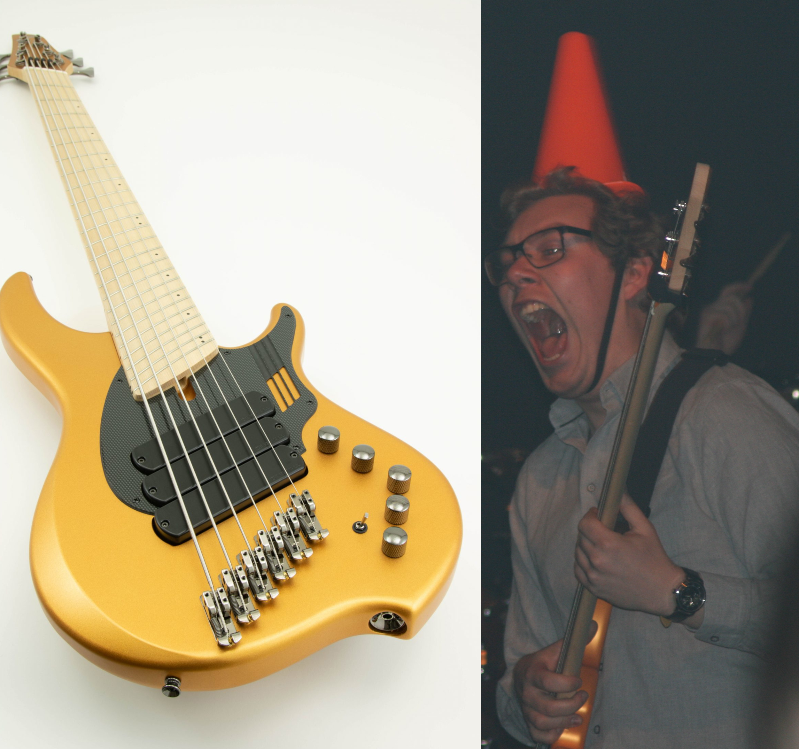
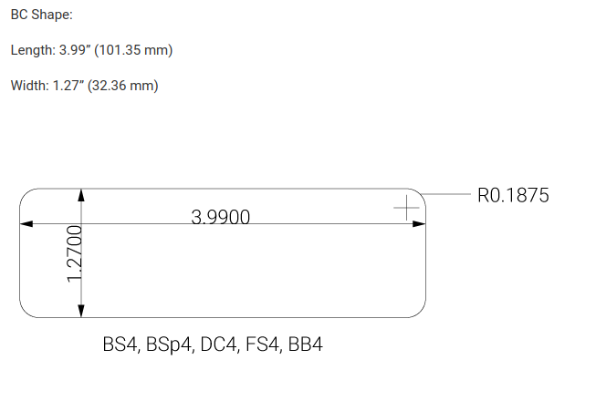
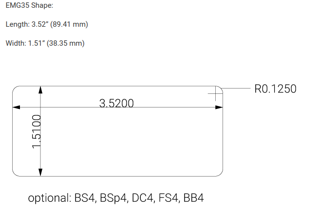
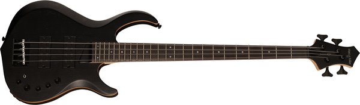

# The DONG
Jag har länge velat haft en bra fyrsträngad bas med lite proggit ton. Något med mycket EQ kontroller och lätt dist.

{ align=right }

En av mina favoritbasar har varit en av mina vänners [Dingwall NG ADAM “NOLLY” GETGOOD SIGNATURE](https://dingwallguitars.com/bass/ng-adam-nolly-getgood-signature/). Den har ett riktigt tjockt ljud med fantastisk inbyggd dist som låter oerhört naturligt. Här är en bild på mig när jag spelar på den, med en kon på huvudet.

Enda nackdelen med den modellen är att den kostar 30 290 kr... Det är något mer än vad jag för tillfället har möjlighet att lägga på en bas.
<!-- 2 699 € -->

Min fundering var därför; kan jag bygga en bas som låter någorlunda likt en Dingwall, fast för ett lägre pris?

Mitt resonemang var följande; Det som gör en Dingwall NG ADAM “NOLLY” GETGOOD SIGNATURE nice att spela på är.

- Dess extra långa strängar med fan frets för att förlänga de lägsta strängarna ännu längre.
- Dess extra strängbrädd. En vanlig fem-/sexsträngad bas har en smalare strängbrädd för att kunna ha en smalare hals. Men en Dingwall har (iallafall den femsträngade) samma strängbredd som en fyrsträngad bas, dvs 18mm.
- Tre av Dingwalls egna soapbar pickups.
- En Darkglass preamp.

Stränglängd är svårt att göra något åt på en billigare bas, så den faktorn får man leva med. Men strängbredd går enkelt att lösa igenom att bara använda en fyrsträngad bas. Det råkade vara så att jag ville ha just en fyrsträngad, så det var inte ett problem.

Jag vill gärna ha en bas som kan gå ner till ett lågt D, då det är den lägsta tonen som jag själv tycker låter bra att spela i de flesta sammanhang. Det är bara två halvsteg lägre än en vanlig fyrsträngad bas kan gå. Därför är min plan att stämma hela basen två halvsteg lägre.

Dingwalls pickups går inte att få tag på i "normala" formfaktorer. De är gjorda just för Dingwalls strängbredd och för att kunna lutas. Men det råkar vara så att en annan tillverkare vid namn [Nordstrand Audio](https://nordstrandaudio.com/) gör en modell av pickups de kallar [DINGSTRAND NORDWALL](https://nordstrandaudio.com/collections/4-string-soapbar-bass-pickups/products/dingstrand-nordwall-4). Dessa är soapbar pickups som är gjorda för att efterlikna Dingwalls pickups, men i standard formfaktorer.

Slutligen har vi preampen som sitter i Dingwallen. Det är en [Darkglass Tone Capsule](https://www.darkglass.com/creation/tone-capsule/) som, då det inte är Dingwalls egna preamp, också går att köpa separat.

## Planen

Min plan var då följande.

- Hitta en fyrsträngad bas som har hål för pickups nog stora för att kunna montera ett sett [DINGSTRAND NORDWALL](https://nordstrandaudio.com/collections/4-string-soapbar-bass-pickups/products/dingstrand-nordwall-4) pickups i.
- Köp ett par av pickupsen och montera i basen
- Köp en [Darkglass Tone Capsule](https://www.darkglass.com/creation/tone-capsule/) och montera i basen.
- Byt strängarna till en grövre tjocklek för att kunna stämma ner basen men behålla spänsten i dem.

## Välj en bas

För att lätt kunna byta pickupsen till [DINGSTRAND NORDWALL](https://nordstrandaudio.com/collections/4-string-soapbar-bass-pickups/products/dingstrand-nordwall-4) pickups, behöver vi en bas vars pickups är av samma eller större storlek. _Standardisering_ är dock inte något som appliceras på baspickups. Även om pickups är av samma typ betyder det tyvärr inte att deras pickups är i samma formfaktor/storlek.

{ align=right }
{ align=right }

Som tur är råkar [Nordstrand Audio](https://nordstrandaudio.com/) vara en av få pickuptillverkare som tords skriva dimensionerna på sina pickups på deras sida. Varför detta inte tillhör standarden för bastillverkare kan jag tyvärr inte svara på...

[DINGSTRAND NORDWALL](https://nordstrandaudio.com/collections/4-string-soapbar-bass-pickups/products/dingstrand-nordwall-4) kommer i två modeller. En bredare som är utformad efter en _Bartolini BC_ och är $101.35$ bred och $32.6$ mm hög, samt en smalare modell som är utformad efter en _EMG 35_ som är $89.41$ mm bred och $38.35$ mm hög.

Jag hittade en bas som hade de pickups Nordstrands modeller var dimensionerade efter. [Harley Benton TB-70](https://www.thomann.de/intl/harley_benton_tb_70_sbk_deluxe_series_bundle.htm) har ett par EMG35 pickups i sig. Den enda nackdelen är dock att det är en ganska ful bas...

Min lösning var dock istället att kolla på ett antal basar vars pickups jag gissade var nära i storlek, och sedan maila Thomann och fråga om måtten. Jag vill påpeka att Thomanns serviceavdelning är utomordentliga och ska verkligen få beröm för deras hjälpsammet. Det här projektet hade inte gått att genomföra utan dem.

Då basar med soapbar pickups är svåra att få tag på i de lägre prisklasserna, valde jag ut ett antal basar med dubbla humbucker pickups, då dessa verkar stämma bäst överens rent storleksmässigt. Jag valde även några femsträngade basar, då jag ännu inte var säker på om jag ville ha fem eller fyrsträngat.

Följande dimensioner på modeller fick jag från Thomann.

- [Ibanez SR300EB-WK](https://www.thomann.de/se/ibanez_sr300eb_wk.htm) - $99$ mm x $33$ mm.
- [Ibanez SR305EB-WK](https://www.thomann.de/gb/ibanez_sr305eb_wk.htm) - $107$ mm x $33$ mm.
- [Yamaha TRBX 304](https://www.thomann.de/gb/yamaha_trbx_305_bl.htm) - $108$ mm x $37.5$ mm.
- [Marcus Miller M2 TBK 2nd Gen](https://www.thomann.de/gb/marcus_miller_m2_tbk_2nd_gen.htm) - $101$ mm x $37.5$ mm
- [Harley Benton B-450 Progressive Serie](https://www.thomann.de/gb/harley_benton_b_450_black_progressive_serie.htm) - $100$ mm x $32$ mm.

{ align=right }

Ett par millimeter för smala pickups skulle nog gå alldeles utmärkt, då hålen för pickupsen antagligen är ca $1.5$ mm bredare än pickupsen på varje sida. I värsta fall skulle jag också kunna fila upp hålen en aning.

Men jag beslutade mig tillslut för en [Marcus Miller M2 TBK 2nd Gen](https://www.thomann.de/gb/marcus_miller_m2_tbk_2nd_gen.htm), då den verkar ha ungefär samma bredd på sina pickups, men aningen längre. Det råkar även vara den modellen jag personligen tycker ser bäst ut.

## Montera preamp

## Kostnad

Följande delar behövde jag köpa.

| Del | Produkt | Pris |
|:-|:-|-:|
| Bas | [Marcus Miller M2 TBK 2nd Gen](https://www.thomann.de/gb/marcus_miller_m2_tbk_2nd_gen.htm) | 4 077 kr <!-- £309 --> |
| Preamp | [Darkglass Tone Capsule](https://www.darkglass.com/creation/tone-capsule/) | 1 999 kr <!-- £159 --> |
| Strängar | [Daddario EPS230 strängar](https://www.thomann.de/gb/daddario_eps_230_ebasssaiten.htm) | 319 kr <!-- £24.90 --> |
| Summa | | 6 395 kr |